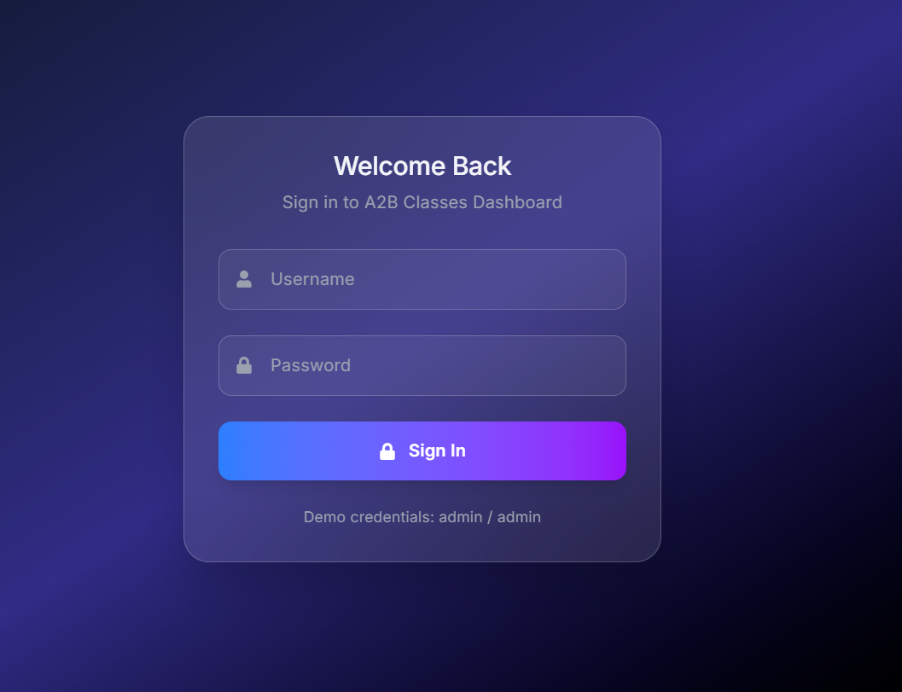
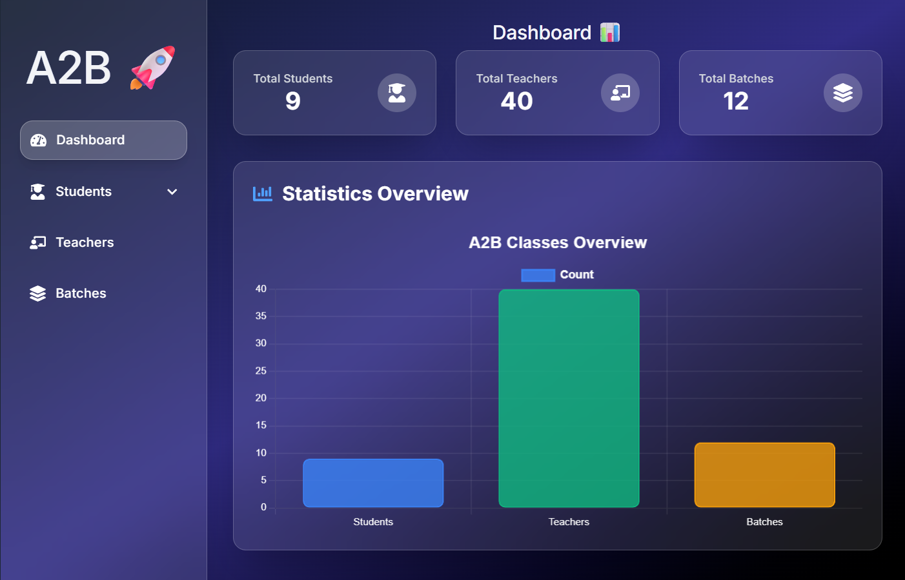
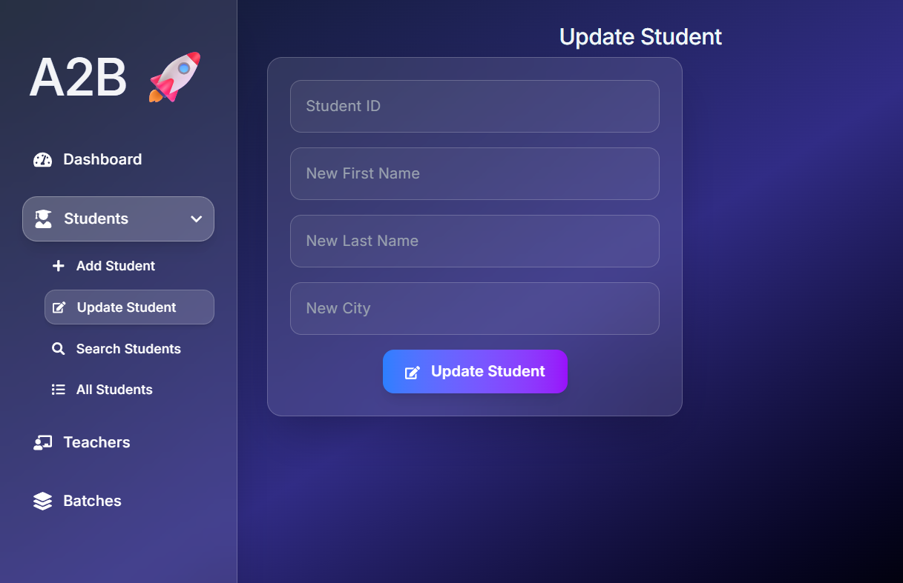
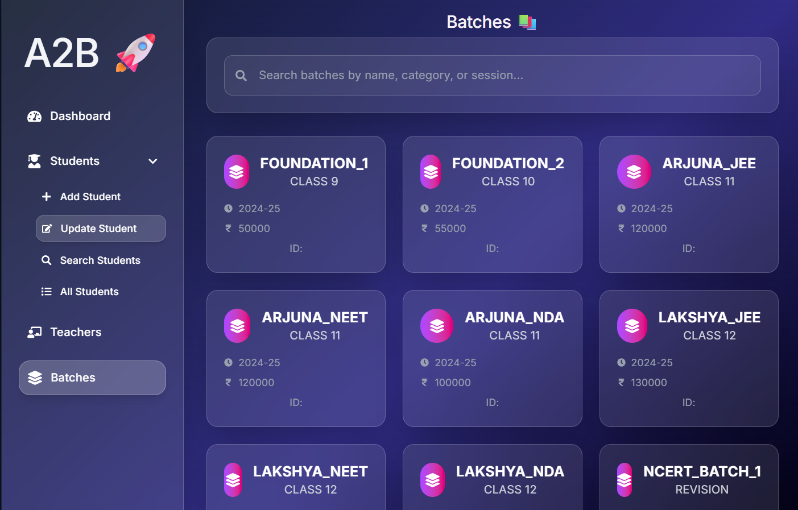

# 🎓 A2B Classes Management System

A modern full-stack Coaching Institute Management System that simplifies student, teacher, and batch management through an intuitive dashboard with real-time statistics and CRUD operations.

---

## ✨ Features

- 🔐 Admin Login Authentication
- 📊 Interactive Dashboard
- 👨‍🎓 Student Management (CRUD)
- 👨‍🏫 Teacher Management
- 📚 Batch Management
- 🔍 Search Students & Batches
- 📈 Statistics Dashboard
- 🎨 Modern Responsive UI
- ⚡ REST API Backend
- 💾 Database Integration

---

# 📸 Screenshots

## Login Page



---

## Dashboard



---

## Update Student



---

## Batch Management



---

## 🛠 Tech Stack

### Frontend

- React.js
- Vite
- JavaScript
- CSS3

### Backend

- Python
- Flask
- SQLite
- REST API

---

## 📂 Project Structure

```
A2B_CLASSES
│
├── backend
│   ├── routes
│   ├── app.py
│   ├── db.py
│   └── requirements.txt
│
├── frontend
│   ├── src
│   ├── package.json
│   └── vite.config.js
│
├── screenshots
│   ├── login.png
│   ├── dashboard.png
│   ├── update-student.png
│   └── batches.png
│
├── .gitignore
└── README.md
```

---

## 🚀 Installation

Clone the repository

```bash
git clone https://github.com/ARADHYA200/A2B_CLASSES.git
```

Backend

```bash
cd backend

pip install -r requirements.txt

python app.py
```

Frontend

```bash
cd frontend

npm install

npm run dev
```

---

## 📊 Modules

- Admin Authentication
- Dashboard Analytics
- Student Management
- Teacher Management
- Batch Management
- Search & Filter
- CRUD Operations

---

## 👨‍💻 Author

**Aradhya Agarwal**

GitHub: https://github.com/ARADHYA200

---

## ⭐ If you like this project, give it a Star!